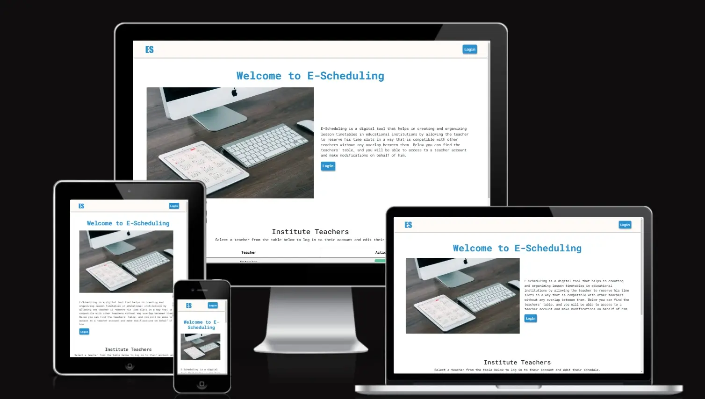
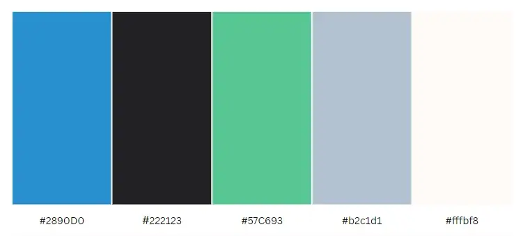

# Project Planning E-Scheduling

Welcome to E-Scheduling – Your Trusted Online Time Scheduling Platform

Visit the deployed site: [E-Scheduling](https://hourianouhkhanjar.github.io/e-scheduling)

## Project Description

E-Scheduling is a digital tool that helps in creating and organizing lesson timetables in educational institutions. The website provides an easy-to-use interface for manually creating timetables, with the ability to customize lesson times, assign teachers to different classes, and adjust the schedule according to daily requirements. 

It also helps in reducing human errors and improving time management within schools or universities, allowing all stakeholders (teachers, students, and administrators) to easily track the schedule across various devices.

- - -

## CONTENTS

* [User Experience](#user-experience-ux)
  * [Bussiness Goal](#bussiness-goal)
  * [User Goal](#user-goal)
  * [Explaining E-Scheduling Idea](#explaining-the-core-idea-process)
  * [User Stories](#user-stories)

* [Design](#design)
  * [Colour Scheme](#colour-scheme)
  * [Typography](#typography)
  * [Imagery](#imagery)
  * [Wireframes](#wireframes)
  * [Features](#features)
    * [Start Page](#start-page)
    * [Account Page](#account-page)
    * [Schedule Page](#schedule-page)

- - -

## User Experience (UX)

## Goals

### Bussiness Goal
The business goal of this project is to improve operational efficiency and enhance the user experience within the educational institution. Key objectives include:

- **Increase productivity** by reducing the time and effort required for manually creating and managing schedules.
- **Minimize scheduling conflicts and optimize the use of resources**(teachers, classrooms, etc.), leading to better overall management.

### User Goal
The user goal of this project (a lesson schedule management app for an educational institution) is to easily create, manage, and access their class schedules. Users, including teachers, students, and administrators, aim to:

- **Teachers:** Efficiently manage their teaching schedules, avoid overlapping lessons, and ensure they are assigned to the right classes at the right times.
- **Students:** Easily access and view their class timetables, minimizing confusion about lesson times and locations.
- **Administrators:** Streamline the scheduling process, make quick adjustments to timetables, and ensure optimal resource allocation (e.g., classrooms, teachers).

- - - 

##  Explaining the core idea process
In this phase we will focus on the core of the idea, which is to allow teachers to reserve their time slots in a way that is compatible with other teachers without any overlap between them.

### Teacher Side:
We will assume that each teacher has an account with a username and password that allows them to log into their account.
After logging in, the teacher can select the class and then modify their schedule according to the following modification conditions:

- The teacher can reserve the time slot if none of the other teachers have reserved it until that moment.
- The teacher can reserve the time slot if it has not already been reserved for the other classes they teach.
- The teacher can cancel the time slot reservation.

Once the teacher finishes modifying his schedule, he can save the changes. The program will then verify if any other teacher has made modifications before the save process. If so, the teacher will be prompted to review their options.

*Note 1: The teacher can make the modification as long as the administrator has not activated the cancellation of the modification.*

*Note 2: The initial data will be stored using JSON files. And all the modifications will be stored in the brorowser storage in this phase*

### Admin Side:
As mentioned earlier, the main idea of the project is to allow teachers to create their schedules smoothly and easily, without delving into other project details.Therefore, the website will begin by displaying a main page, which we will consider as the system administrator's page. From here, the administrator can log into any teacher' account and reset all schedules to their initial state, ie., cancel all reservations for teachers. Additionally, the administrator has the option to disable the ability to modify the schedules once each teacher has completed their time slots.

*To facilitate control and monitor the process, the administrator will be allowed to login instead of the teachers. As a result, the teachers' table will be displayed on the main page, and the administrator will be able to access and make modifications on behalf of the teachers.*

### User Stories
1- **Login as a teacher:**
   The administrator can login on behalf of the teachers. Therefore, the teachers' table will be displayed on the first page of the website, with the option to log into the teachers' accounts.

2- **Classes list:**
   The teacher's assigned classes will be displayed, and they can select a class to modify its schedule.

3- **Edit schedule:**
   The schedule will be displayed, allowing the teacher to reserve or cancel time slots in accordance with the booking conditions. Once the modifications are complete, the teacher can save the changes they made.

4- **Sign out:**
   The administrator is allowed to sign out of a teacher's account in order to login with another teacher's account. 
   *It is important to note that the administrator can login with different teacher accounts from different browsers.*

5- **Reset all schedules:**
   Allow administrator to reset all schedules to their initial state, i.e., cancel all reservation for teachers.

6- **Disable all modifications:**
   Allow administrator to disable the ability to modify the schedules once each teacher has completed their time slots.

- - - 

## Design

### Colour Scheme

The colors used on E-scheduling website are often associated with calmness, trust, and focus. It has a soothing effect on the mind, which is ideal for a planing environment.

In my css file I have used variables to declare colours. 

* I have used `#2890D0` as the primary color for main actions.
* I have used `#57C693` as the secondary color for secondary actions.
* I have used `#fffbf8` as background color for header and footer.
* I have used `#b2c1d1` as background color for disabled time slot.

### Typography

Google Fonts was used to import the chosen fonts for use in the site.

* I have used the google font [Roboto Mono](https://fonts.google.com/specimen/Roboto+Mono) for headers and body text.

These fonts would provide a strong balance of readability and professionalism on a scheduling website.

