# Project Planning E-Scheduling
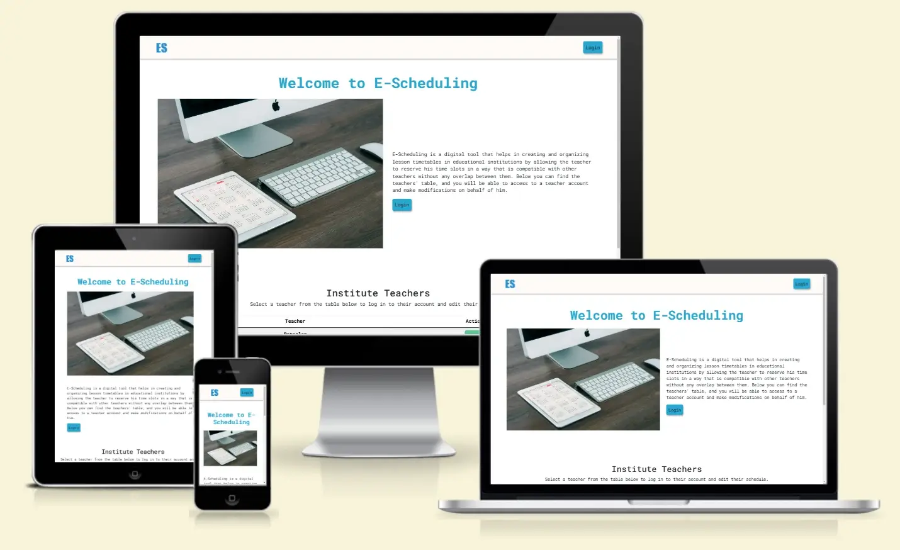
Welcome to E-Scheduling – Your Reliable Online Time Management Platform.

Visit the deployed site: [E-Scheduling](https://hourianouhkhanjar.github.io/e-scheduling)

## Project Description

E-Scheduling is a digital tool designed to help create and organize lesson timetables in educational institutions. The website offers an intuitive interface for manually generating timetables, allowing for customization of lesson times, assigning teachers to different classes, and adjusting the schedule based on daily needs.

Additionally, it helps reduce human errors and enhances time management within schools and universities. All stakeholders—teachers, students, and administrators—can easily track the schedule across various devices.
- - -

## CONTENTS

* [User Experience](#user-experience-ux)
  * [Bussiness Goal](#bussiness-goal)
  * [User Goal](#user-goal)
  * [Explaining E-Scheduling Idea](#explaining-the-core-idea-process)
  * [User Stories](#user-stories)

* [Design](#design)
  * [Colour Scheme](#colour-scheme)
  * [Typography](#typography)
  * [Imagery](#imagery)
  * [Wireframes](#wireframes)
  * [Features](#features)
    * [Start Page](#start-page)
    * [Account Page](#account-page)
    * [Schedule Page](#schedule-page)
  * [Accessibility](#accessibility)

  * [Technologies Used](#technologies-used)
      * [Languages Used](#languages-used)
      * [Frameworks, Libraries & Programs Used](#frameworks-libraries--programs-used)
  
  * [Deployment & Local Development](#deployment--local-development)
      * [Deployment](#deployment)
      * [Local Development](#local-development)
         * [How to Fork](#how-to-fork)
         * [How to Clone](#how-to-clone)

   * [Credits](#credits)
      * [Code Used](#code-used)
      * [Content](#content)
      * [Media](#media)
      * [Acknowledgments](#acknowledgments)

- - -

## User Experience (UX)

## Goals

### Bussiness Goal
The business goal of this project is to improve operational efficiency and enhance the user experience within the educational institution. Key objectives include:

- **Increase productivity** by reducing the time and effort required for manually creating and managing schedules.
- **Minimize scheduling conflicts and optimize the use of resources**(teachers, classrooms, etc.), leading to better overall management.

### User Goal
The user goal of this project (a lesson schedule management app for an educational institution) is to easily create, manage, and access their class schedules. Users, including teachers, students, and administrators, aim to:

- **Teachers:** Efficiently manage their teaching schedules, avoid overlapping lessons, and ensure they are assigned to the right classes at the right times.
- **Students:** Easily access and view their class timetables, minimizing confusion about lesson times and locations.
- **Administrators:** Streamline the scheduling process, make quick adjustments to timetables, and ensure optimal resource allocation (e.g., classrooms, teachers).

- - - 

##  Explaining the core idea process
In this phase we will focus on the core of the idea, which is to allow teachers to reserve their time slots in a way that is compatible with other teachers without any overlap between them.

### Teacher Side:
We will assume that each teacher has an account with a username and password that allows them to log into their account.
After logging in, the teacher can select the class and then modify their schedule according to the following modification conditions:

- The teacher can reserve the time slot if none of the other teachers have reserved it until that moment.
- The teacher can reserve the time slot if it has not already been reserved for the other classes they teach.
- The teacher can cancel the time slot reservation.

Once the teacher finishes modifying his schedule, he can save the changes. The program will then verify if any other teacher has made modifications before the save process. If so, the teacher will be prompted to review their options.

*Note 1: The teacher can make the modification as long as the administrator has not activated the cancellation of the modification.*

*Note 2: The initial data will be stored using JSON files. And all the modifications will be stored in the brorowser storage in this phase*

### Admin Side:
As mentioned earlier, the main idea of the project is to allow teachers to create their schedules smoothly and easily, without delving into other project details.Therefore, the website will begin by displaying a main page, which we will consider as the system administrator's page. From here, the administrator can log into any teacher' account and reset all schedules to their initial state, ie., cancel all reservations for teachers. Additionally, the administrator has the option to disable the ability to modify the schedules once each teacher has completed their time slots.

*To facilitate control and monitor the process, the administrator will be allowed to login instead of the teachers. As a result, the teachers' table will be displayed on the main page, and the administrator will be able to access and make modifications on behalf of the teachers.*

### User Stories
1- **Login as a teacher:**
   The administrator can login on behalf of the teachers. Therefore, the teachers' table will be displayed on the first page of the website, with the option to log into the teachers' accounts.

2- **Classes list:**
   The teacher's assigned classes will be displayed, and they can select a class to modify its schedule.

3- **Edit schedule:**
   The schedule will be displayed, allowing the teacher to reserve or cancel time slots in accordance with the booking conditions. Once the modifications are complete, the teacher can save the changes they made.

4- **Sign out:**
   The administrator is allowed to sign out of a teacher's account in order to login with another teacher's account. 
   *It is important to note that the administrator can login with different teacher accounts from different browsers.*

5- **Reset all schedules:**
   Allow administrator to reset all schedules to their initial state, i.e., cancel all reservation for teachers.

6- **Disable all modifications:**
   Allow administrator to disable the ability to modify the schedules once each teacher has completed their time slots.

- - - 

## Design

### Colour Scheme

The colors used on E-scheduling website are often associated with calmness, trust, and focus. It has a soothing effect on the mind, which is ideal for a planing environment.

In my css file I have used variables to declare colours. 

* I have used `#28A7D1` as the primary color for main actions.
* I have used `#57C693` as the secondary color for secondary actions.
* I have used `#fffbf8` as background color for header and footer.
* I have used `#b2c1d1` as background color for disabled time slot.
* I have used `#222123` as text color.

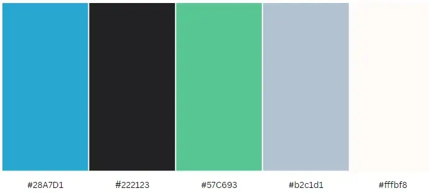

### Typography

Google Fonts was used to import the chosen fonts for use in the site.

* I have used the google font [Roboto Mono](https://fonts.google.com/specimen/Roboto+Mono) for headers and body text.

These fonts would provide a strong balance of readability and professionalism on a scheduling website.

### Imagery

I have chosen a representative image for the website on the start page that displays a calendar and a computer to symbolize the transition from the traditional manual method of selecting the time table plan from the calendar to a digitized layout.

### Wireframes

Wireframes were created for mobile, tablet and desktop using balsamiq.

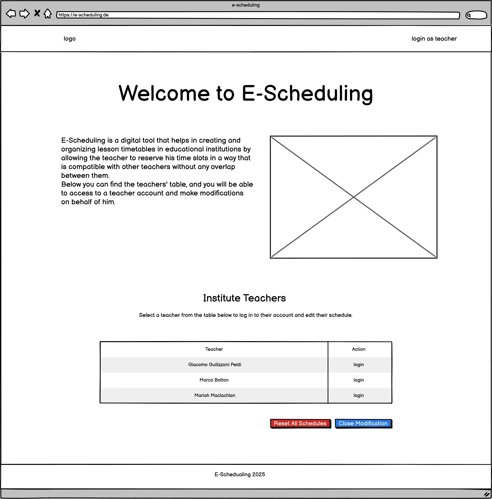

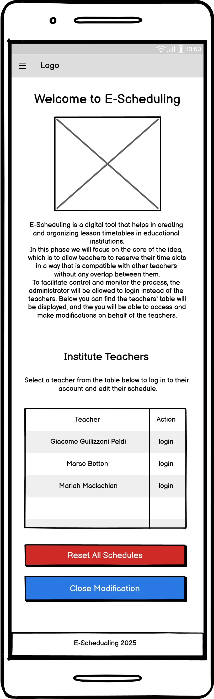

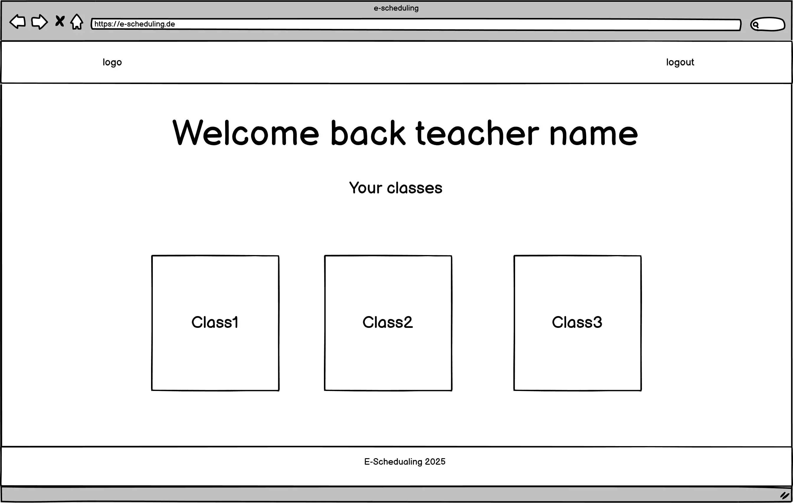

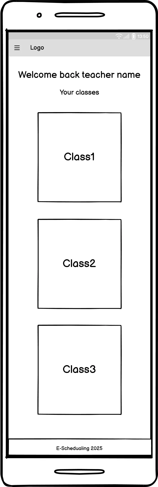

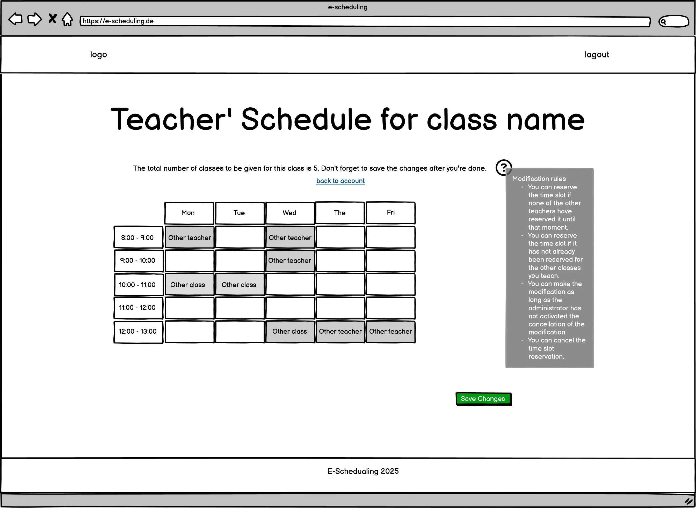

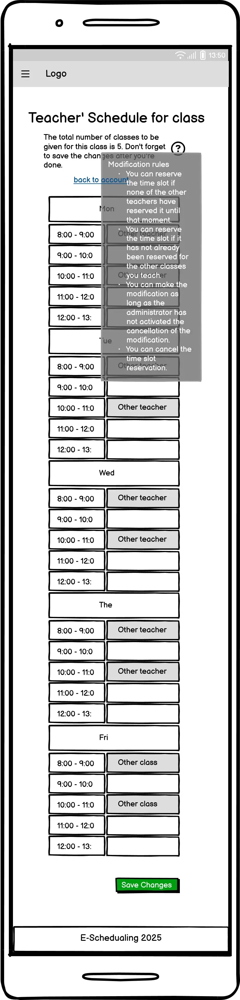

### Features

The website is contains start page, account page and schedule page.

All Pages on the website are responsive.

#### Start Page

The start page displays the folwing sections:

- **Navbar section:** contains the logo and a login button that when clicked takes the user to the teachers table section.

- **Header section:** contains a simple definition phrase, simple image and a login button that when clicked takes the user to the teachers table section. 

- **Teachers table section:** Each row display teacher name and a login button that when clicked takes the user to the teacher account page. 

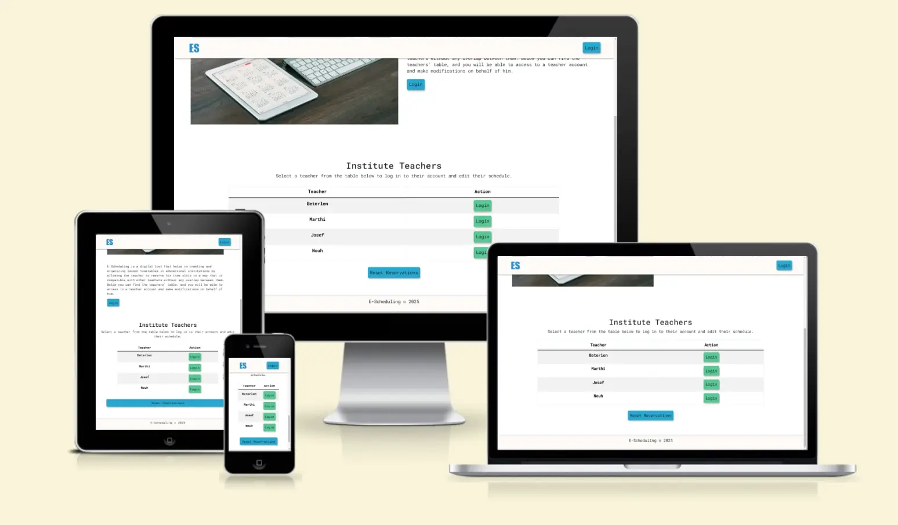

- **Footer section and contact us form:** contains website's name and the publishing year.

#### Account Page

The account page displays the folwing sections:

- **Navbar section:** contains the logo and a logout button that when clicked takes the user to the start page.

- **Header section:** contains a welcome phrase and the teacher name. 

- **classes list section:** each card displays the class name and modify schedule button that when clicked takes the user to the schedule page. 

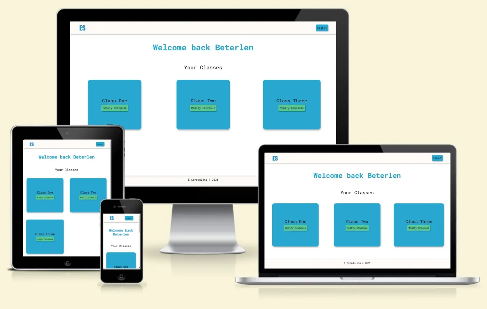

- **Footer section and contact us form:** contains website's name and the publishing year.

#### Schedule Page

The schedule page displays the folwing sections:

- **Navbar section:** contains the logo and a logout button that when clicked takes the user to the start page.

- **Header section:** contains a phrase that define the teacher and class. In addition it includes the instructions for modifying the schedule. 
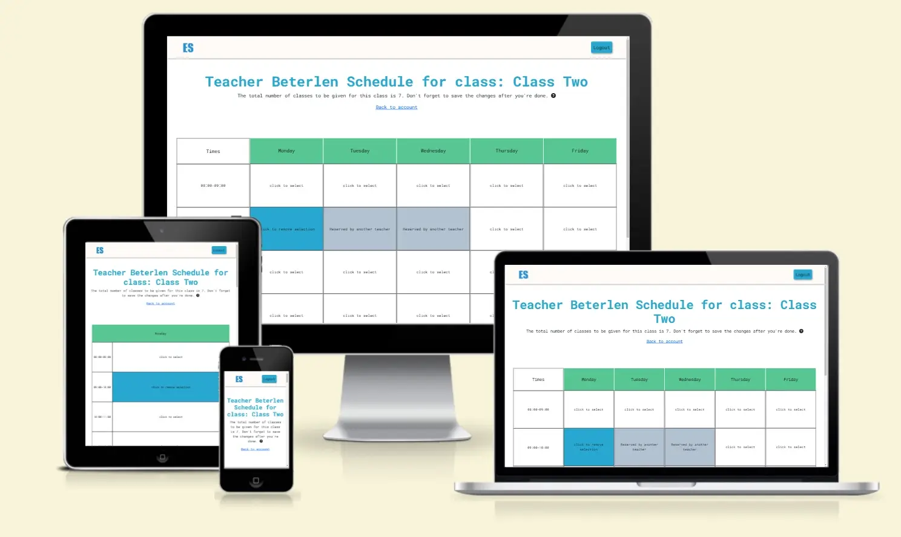

- **time slots section:** displays time slots table. 
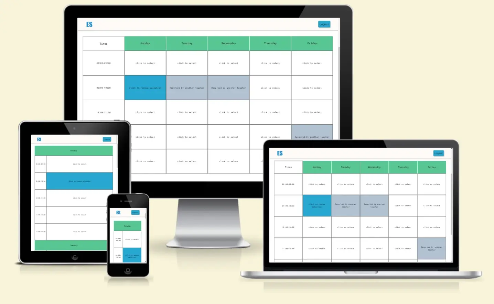

- **Footer section and contact us form:** contains website's name and the publishing year.

### Accessibility

I have been careful while coding to ensure the website is as user-friendly and accessible as possible. This has been accomplished by:

* Using semantic HTML.
* Implementing a hover state on all buttons across the site, I made sure it is clear to the user when they are hovering over a button.
* Making sure there is adequate color contrast throughout the site to enhance readability and accessibility.

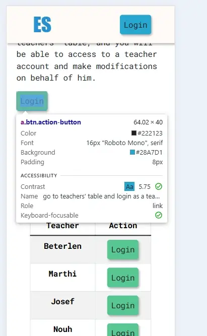
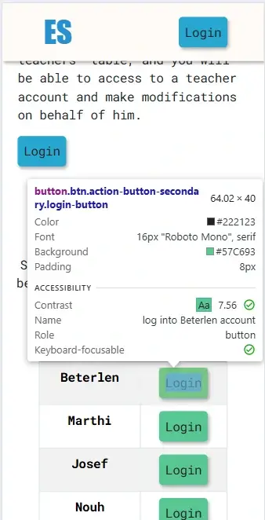
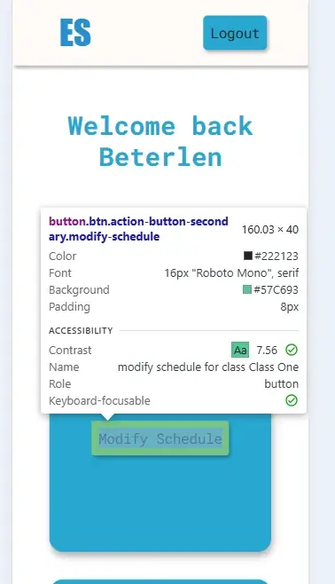
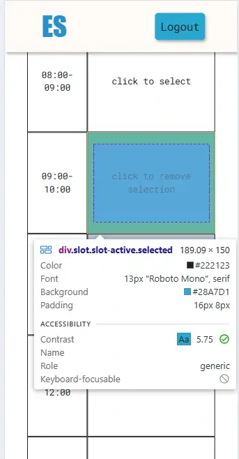
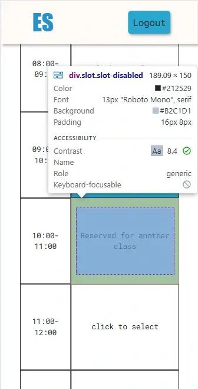

- - - 

## Technologies Used

### Languages Used

HTML, CSS, Bootstrap, Javascript

### Frameworks, Libraries & Programs Used

* [Balsamiq](https://balsamiq.com/) - Used to create wireframes.

* [Git](https://git-scm.com/) - For version control.

* [Github](https://github.com/) - To save and store the files for the website.

* [GitPod](https://gitpod.io/) - IDE used to create the site.

* [Google Fonts](https://fonts.google.com/) - To import the fonts used on the website.

* [Google Developer Tools](https://developers.google.com/web/tools) - To troubleshoot and test features, solve issues with responsiveness and styling.

* [TinyPNG](https://tinypng.com/) To compress images

* [Birme](https://www.birme.net/) To resize images and convert to webp format.

* [Am I Responsive?](http://ami.responsivedesign.is/) To show the website image on a range of devices.

- - -

## Deployment & Local Development

### Deployment

The site is deployed using GitHub Pages - [E-Scheduling](https://hourianouhkhanjar.github.io/e-scheduling/).

To Deploy the site using GitHub Pages:

1. Login (or signup) to Github.
2. Go to the repository for this project, [HouriaNouhKhanjar/e-scheduling](https://github.com/HouriaNouhKhanjar/e-scheduling).
3. Click the settings button.
4. Select pages in the left hand navigation menu.
5. From the source dropdown select main branch and press save.
6. The site has now been deployed, please note that this process may take a few minutes before the site goes live.

### Local Development

#### How to Fork

To fork the repository:

1. Log in (or sign up) to Github.
2. Go to the repository for this project, [HouriaNouhKhanjar/e-scheduling](https://github.com/HouriaNouhKhanjar/e-scheduling)
3. Click the Fork button in the top right corner.

#### How to Clone

To clone the repository:

1. Log in (or sign up) to GitHub.
2. Go to the repository for this project, [HouriaNouhKhanjar/e-scheduling](https://github.com/HouriaNouhKhanjar/e-scheduling)
3. Click on the code button, select whether you would like to clone with HTTPS, SSH or GitHub CLI and copy the link shown.
4. Open the terminal in your code editor and change the current working directory to the location you want to use for the cloned directory.
5. Type 'git clone' into the terminal and then paste the link you copied in step 3. Press enter.

- - -

## Credits

### Code Used

* I used [this Javascript documentation](https://developer.mozilla.org/en-US/docs/Web/JavaScript)  to process arrays, such as searching, filtering, and other operations, in addition to handling operations with localStorage.

* I used [this Javascript code](https://www.geeksforgeeks.org/read-json-file-using-javascript/) to fetch Data from Json file.

* I used [this CSS code](https://css-loaders.com/progress/) to diplay a loader while fetching the data.

* I used [this Javascript code](https://www.w3schools.com/howto/howto_js_redirect_webpage.asp) to redirect to another page.

* I used [this Stackoverflow code](https://stackoverflow.com/questions/4025635/how-can-i-change-the-last-component-of-a-url-path) to replace the last component of an url.

* I used [this Bootstrap documentation](https://getbootstrap.com/docs/5.3/components/tooltips/#overview) to display a tooltips on hovering.

### Content

All content for the site, such as introduction messages and instructions were written by myself.

### Media

* The main image in start page was taken from [pexels](https://www.pexels.com/).

### Acknowledgments

I would like to acknowledge the following people:

* Jubril Akolade - My Code Institute Mentor.

* The Code Institute Course that prepared me to complete this project in the best possible way..

