# E-Scheduling -  Testing

Visit the deployed site: [E-Scheduling](https://hourianouhkhanjar.github.io/e-scheduling)

- - -

## CONTENTS

* [AUTOMATED TESTING](#automated-testing)
  * [W3C Validator](#w3c-validator)
  * [JavaScript Validator](#javascript-validator)
  * [Lighthouse](#lighthouse)

* [MANUAL TESTING](#manual-testing)
  * [Testing User Stories](#testing-user-stories)
  * [Full Testing](#full-testing)

- - -

## AUTOMATED TESTING

### W3C Validator

[W3C](https://validator.w3.org/) was used to validate the HTML and CSS of the website.

* index.html - Passed.
* account.html - Passed.
* schedule.html - Passed.

* style.css - Passed, one warning its about the imported fonts.
* loader.css - Passed.

- - -

### JavaScript Validator

[jshint](https://jshint.com/) was used to validate the JavaScript.

* helper.js - Passed, with some warnings. let, const, for of and array functions (filter, find, every, map) are only available in ES6.
* main.js - Passed, with some warnings. let, const, for of and array functions (filter, find, every, map) are only available in ES6.
* account.js - Passed, with some warnings. let, const, for of and array functions (filter, find, every, map) are only available in ES6.
* schedule.js - Passed, with some warnings. let, const, for of and array functions (filter, find, every, map) are only available in ES6.

- - -

### Lighthouse

I used Lighthouse within the Chrome Developer Tools to test the performance, accessibility, best practices and SEO of the website.

**Start page**

**Account page**

*The SEO evaluation is incomplete because the meta description is missing and logically the user should not reach this page without login.*

**Schedule page**

*The SEO evaluation is incomplete because the meta description is missing and logically the user should not reach this page without login.*

- - -

## MANUAL TESTING

### Testing User Stories

`system`

| Goals | How are they achieved? | Image |
| :--- | :--- | :--- |
|  I must fetch the initial data from a repository so that I can work with, check, and process it. | The data structure related to teachers, classes, reservations, and the relationships between them has been modeled in JSON files, which represent the core state of the application. When the start page is loaded for the first time, the data is fetched from the files and stored in local storage. |  |

`system administrator on behalf of teacher`

| Goals | How are they achieved? | Image |
| :--- | :--- | :--- |
|  I can log into teachers' accounts in order to modify their schedules. | On the start page, I have developed a table of teachers and each row contains teacher name and login button, that when clicked on it, the "loggedin_teacher" will be stored in the local storage and it will be redirect to the account page. |  |
|  I want to see a list of teacher's classes, so I can modify class schedule that I chose.|  On account page, I have developed a list of class cards. Each card displays the class name and the "Modify Schedule" Button, that when clicked, schedule page will be loaded and "chosen_class" well be stored in the local storage.|  |
| I want to modify teacher time slots on the displayed schedule so that I can simply reserve or cancel reservation on any time slot.|  On schedule page, I have developed a responsive time slots table. eache slot can be selected or disabled or able to remove the selection from it. After the user finishes making modifications, he can save the modifications, this can be achieved by pressing the save button, then the changes made by the user to the reservations in the storage are saved if the saving conditions are correct. |   |
|  I can sign out of a teacher account to enable another teacher account to log in.|  On the navbar of account and schedule pages I have developed a logout button, that when clicked the "loggedin_teacher" will be removed from the local storage and it will be redirect to the start page.  |  |

`system administrator`

| Goals | How are they achieved? | Image |
| :--- | :--- | :--- |
|  I can reset all schedules to enable the start of the new semester | On the start page, I have developed a "Reset Reservations" button when clicked, The initial state of the reservations will be fetched again from the Json file. and restored in the local storage. |  |
|  I can disable all modifications of schedules in order to prevent any modification of the schedules and thus delay the start of the semester and rely on the final timetable.| On the start page, I have developed a "Close Modifications" button when clicked, the value of "disabled_modification" in the local storage is changed to false, and the "Save Modifications" button on schedule page will be disabled and a "Enable Modifications" button will appear on the start page below th teachers table. The "Close Modifications" button appears when all the teachers have completed reserving their time slots. Alternatively, for testing purposes, the value of "can_disable_modification" can be set to false.  |   |

- - -

### Full Testing

Full testing was performed on the following devices:

* Laptop:
  * HP Laptop 17 2021
* Mobile Devices:
  * iPhone 14 pro max.
  * samsung A53.

Each device tested the site using the following browsers:

* Google Chrome
* Safari

`Start Page`

| Feature | Expected Outcome | Testing Performed | Result | Pass/Fail | Image |
| --- | --- | --- | --- | --- | --- |
| The Sites logo | Link reloads the start page if not loggedin, otherwise directs the user to the account page. | Clicked logo | Start page reloades after checking the local storage value of "loggedin_teacher". If the value of "loggedin_teacher" not null redirects to the account page. | Pass | |
| The Logein button on the navbar | Displays teachers table on start page | Clicked button | The window scrolls to teachers table section on start page. | Pass | |
| The Logein button on Hero section |  Displays teachers table on start page | Clicked on button | The window scrolls to teachers table section on start page.  | Pass | |
| Each login button in teachers table | Stores loggedin_teacher in local storage and redirect to account page  | Clicked on button | Stores the loggedin teacher data in the storage then loads the account page | Pass | 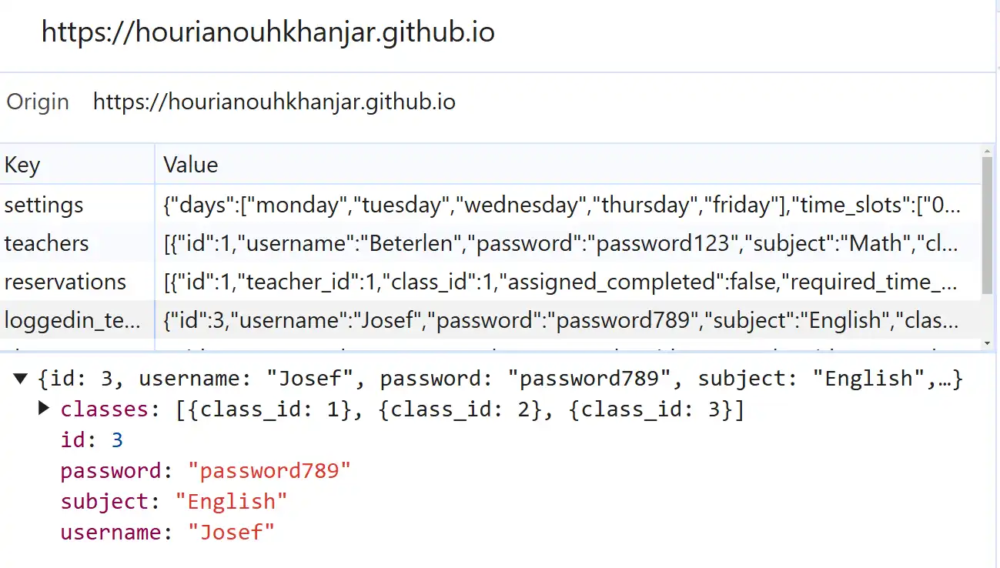 |
| The reset reservations buttton | Resets the reservations in the local storage to its initial state and display a success messgae | Clicked on button | fetchs the reservations from Json file and restores the fetched data in the storage then displays a message modal | Pass |  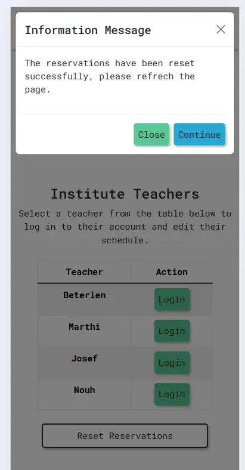 |
| The continue buttton on reset message modal | Reloads the Start page. | Clicked on button | reloads the start page. | Pass | |
| The close modifications button | Disables the modifications of schedules and the "Enable Modifications" button will appear. | Clicked on button | Changes "disable_modification" value in local storage to true and displays the "Enable Modifications" button instead of "Close Modifications" button and displays the success message modal. In addition disables the "Save Modifications" button on Schedule page.| Pass |  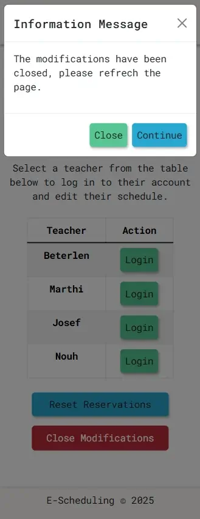 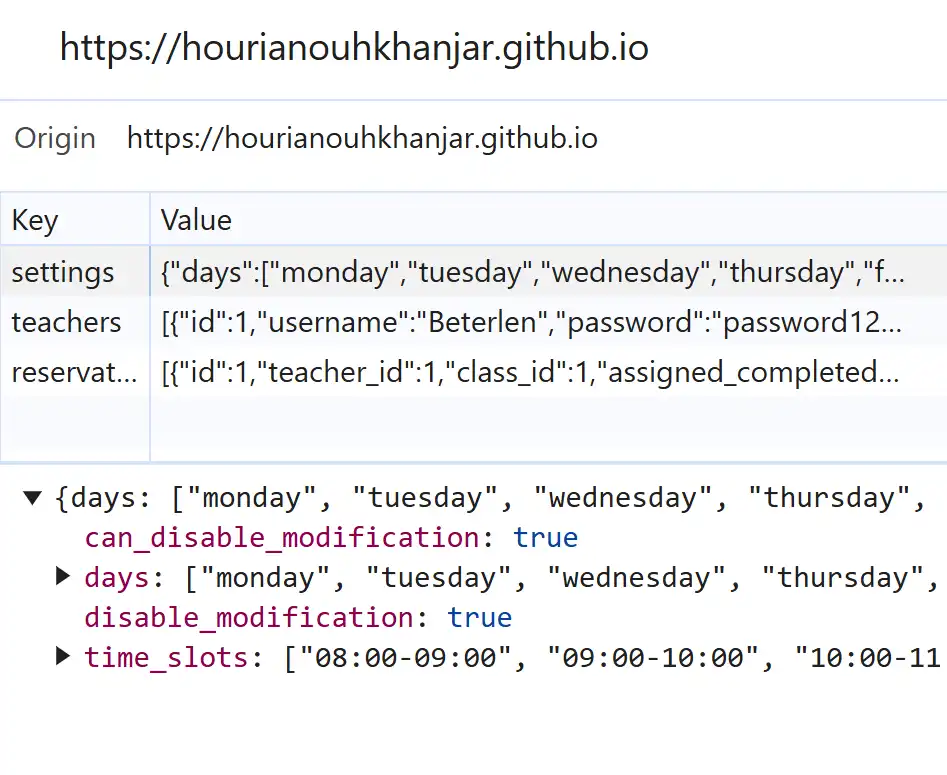 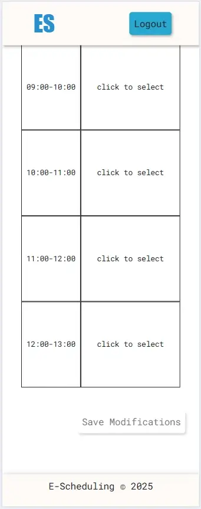|
| The continue buttton on close modifications message modal | Reloads the Start page. | Clicked on button | reloads the start page. | Pass | |
| The enable modifications button | Reenables the modifications of schedules and the "Enable Modifications" button will diappear. | Clicked on button | Changes "disable_modification" value in local storage to false and displays the "Close Modifications" button instead of "Enable Modifications" button and displays the success message modal. In addition enables the "Save Modifications" button on Schedule page. | Pass | 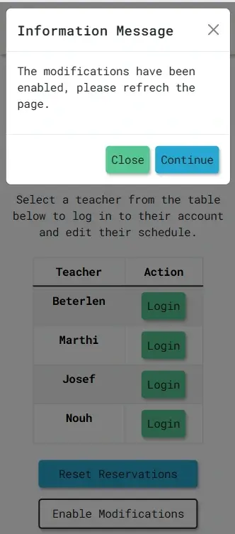 |
| The continue buttton on enable modifications message modal | Reloads the Start page. | Clicked on button | reloads the start page. | Pass | |
| Button hover | Shows an eye-catching effect to the user when the mouse approaches the button | Button hovering | Chanes button style such as background or text color | Pass | 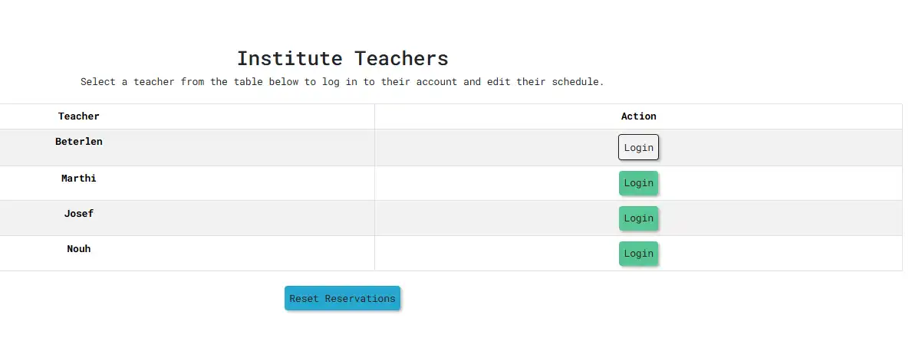 |

 
 

`Account Page`

| Feature | Expected Outcome | Testing Performed | Result | Pass/Fail | Image |
| --- | --- | --- | --- | --- | --- |
| The Sites logo | Reloads the account page if loggedin, otherwise directs the user to the start page. | Clicked logo | Account page reloads after checking the local storage value of loggedin_teacher. If the value of "loggedin_teacher" is null reloads the start page. | Pass | |
| The Logout button on the navbar | Removes "loggedin_teacher" from local storage and redirects to start page.  | Clicked on button | removes the loggedin teacher data from the storage then redirects to the start page. | Pass | |
| The modify schedule button on the class card | If the login data hasn't been changed, stores "chosen_class" in local storage and redirects to schedule page.  Otherwise refreshs the page.  | Clicked on button | Checks the "loggedin_teacher" in the local storage, if not changed then, it stores the "chosen_class" in the local storage and redirects to schedule page. If the loggin data in the local storage has been changed, then displays a message modal in order to refresh the page| Pass | 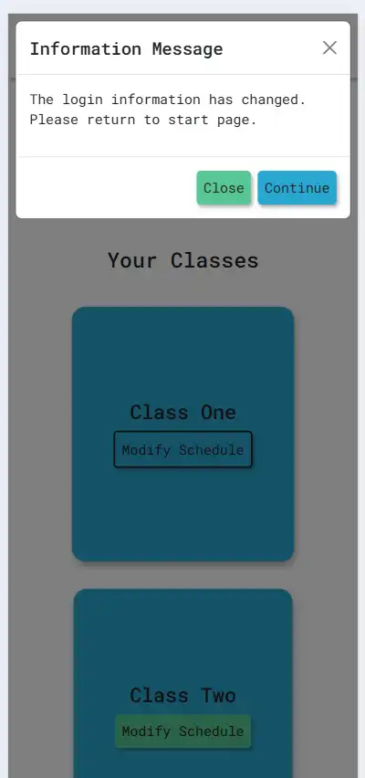 |
| The continue buttton on message modal | Refreshs the page. | Clicked on button |  reloads the start page if loggedin, otherwise reloads account page. | Pass | |
| Button hover | Shows an eye-catching effect to the user when the mouse approaches the button | Button hovering | Chanes button style such as background or text color | Pass | 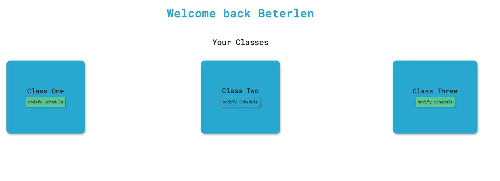 |

 
 

`Schedule Page`

| Feature | Expected Outcome | Testing Performed | Result | Pass/Fail | Image |
| --- | --- | --- | --- | --- | --- |
| The Sites logo | Reloads the account page if loggedin, otherwise directs the user to the start page. | Clicked logo | Account page reloads after checking the local storage value of loggedin_teacher. If the value of "loggedin_teacher" is null reloads the start page. | Pass | |
| The Logout button on the navbar | Removes "loggedin_teacher" from local storage and redirects to start page. | Clicked on button | removes the loggedin teacher data from the storage then redirects to the start page. | Pass | |
| The number of lessons | Displayes the total number of lessons, according to the logged in teacher and chosen class. | On document load | displays the total number of lessons on the header of the page. | Pass |  |
| The question mark icon | Displayes the modifications rules. | Icon hovering | displays the modifications rules list as a tooltips. | Pass | 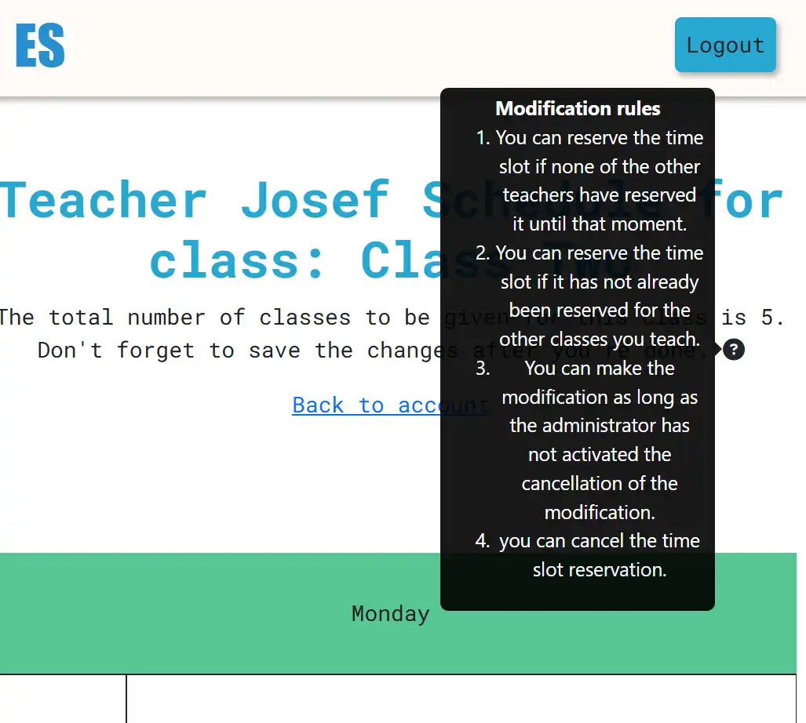 |
| The back to account link | Redirectes to the account page. | Clicked on link | redirects to the account page. | Pass | |
| The disabled time slots | Displays disabled time slots with the reason. | On document load | Displays the disabled time slots, if they have been previously reserved by another teacher for the same class, or if the teacher himself has reserved this time for another class. These time slots cannot be hoverd or selected. | Pass |   |
| The selectable time slots | Displays the selectable time slots. | On document load | Displays the selectable time slots, if they haven't been previously reserved by another teacher for the same class, or if the teacher himself has reserved this time for another class. These time slots can be hoverd or selected. | Pass | 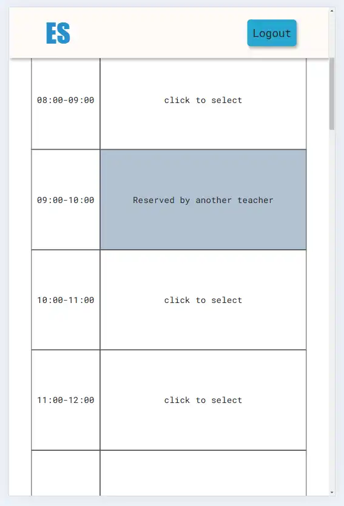  |
| The selected time slots | Displays the selected time slots. | On document load | Displays the selected time slots, if they have been previously reserved by the teacher himself for the chosen class. These time slots can be hoverd or able to remove selection. | Pass |   |
| The time slots hovering | Displays hovering effect on the active time slots. | Time slot hovering | changes the background color on hovering. | Pass |  |
| The time slots selecting | Changes the time slots from selected to not selected and vice versa | Click on time slot | changes the background color and text after clicking. | Pass |  |
| The disabled save modifications button | Disables the save modifications button if the admin closed the modifications | On document load | displays a disabled save modifications button | Pass |   |
| The save modifications button (no changes occurred and all conditions met) | Saves the modifications to reservations in the local storage and display success message | Click on save modifications | saves the new modifications in the storage and display a success message. | Pass | 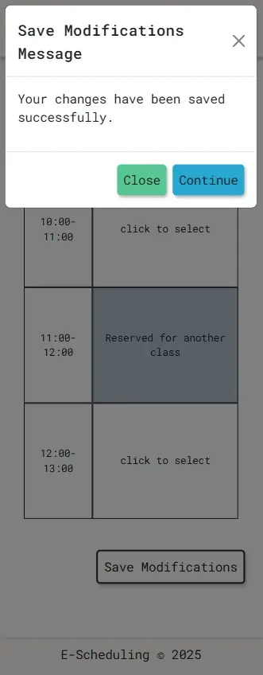  |
| The continue buttton on success message modal | Refreshs the page. | Clicked on button |  reloads the schedule page | Pass | |
| The save modifications button (loggin changes occurred) | Displays a message to redirect to the start page if no teacher is loggedin or to the Account page if any teacher is logged in. | Click on save modifications | Displays a message modal to redirect. | Pass | 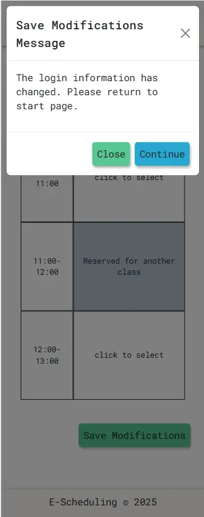  |
| The continue buttton on loggedin changes modal | Redirects to the start page if no teacher is loggedin or to the Account page if any teacher is logged in. | Clicked on button |  redirects to the account or start page. | Pass | |
| The save modifications button (another teacher has made a new modifications or the teacher himself has made some changes on another tab) | Displays a message to refresh the page. | Click on save modifications | Displays a message modal with a refresh message. | Pass | 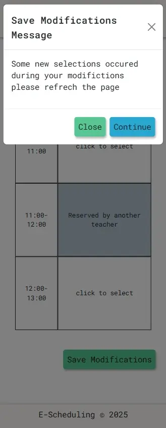  |
| The continue buttton on some changes occurred modal | Refreshs the page. | Clicked on button |  reloads the schedule page | Pass | |
| The save modifications button (the teacher exceeds the hours allocated to chosen class) | Displays a message to remove some selections. | Click on save modifications | Displays a message modal with an informing message of exceeding the number of lessons. | Pass | 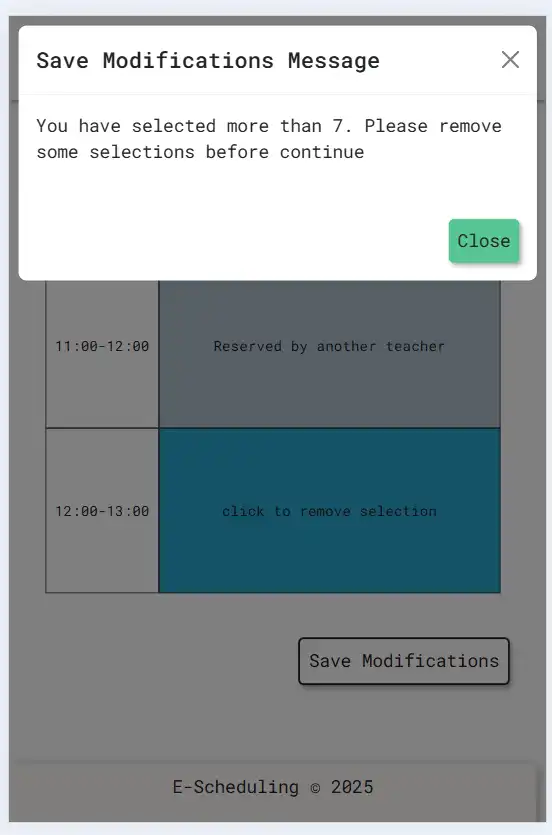  |
