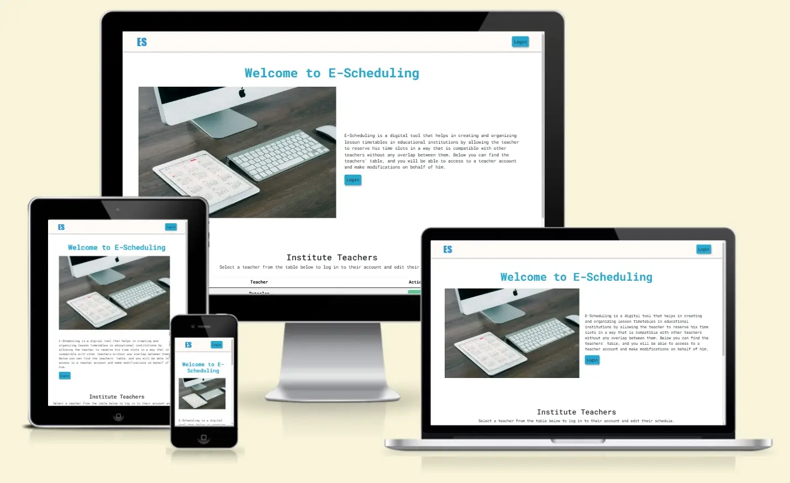

# E-Scheduling -  Testing

Visit the deployed site: [E-Scheduling](https://hourianouhkhanjar.github.io/e-scheduling)

- - -

## CONTENTS

* [AUTOMATED TESTING](#automated-testing)
  * [W3C Validator](#w3c-validator)
  * [JavaScript Validator](#javascript-validator)
  * [Lighthouse](#lighthouse)

* [MANUAL TESTING](#manual-testing)
  * [Testing User Stories](#testing-user-stories)
  * [Full Testing](#full-testing)

- - -

## AUTOMATED TESTING

### W3C Validator

[W3C](https://validator.w3.org/) was used to validate the HTML and CSS of the website.

* index.html - Passed.
* account.html - Passed.
* schedule.html - Passed.

* style.css - Passed, one warning its about the imported fonts.
* loader.css - Passed.

- - -

### JavaScript Validator

[jshint](https://jshint.com/) was used to validate the JavaScript.

* helper.js - Passed, with some warnings. let, const, for of and array functions (filter, find, every, map) are only available in ES6.
* main.js - Passed, with some warnings. let, const, for of and array functions (filter, find, every, map) are only available in ES6.
* account.js - Passed, with some warnings. let, const, for of and array functions (filter, find, every, map) are only available in ES6.
* schedule.js - Passed, with some warnings. let, const, for of and array functions (filter, find, every, map) are only available in ES6.

- - -

### Lighthouse

I used Lighthouse within the Chrome Developer Tools to test the performance, accessibility, best practices and SEO of the website.

**Start page**

**Account page**

*The SEO evaluation is incomplete because the meta description is missing and logically the user should not reach this page without login.*

**Schedule page**

*The SEO evaluation is incomplete because the meta description is missing and logically the user should not reach this page without login.*

- - -

## MANUAL TESTING

### Testing User Stories

`system`

| Goals | How are they achieved? | Image |
| :--- | :--- | :--- |
|  I must fetch the initial data from a repository so that I can work with, check, and process it. | The data structure related to teachers, classes, reservations, and the relationships between them has been modeled in JSON files, which represent the core state of the application. When the start page is loaded for the first time, the data is fetched from the files and stored in local storage. |  |

`system administrator on behalf of teacher`

| Goals | How are they achieved? | Image |
| :--- | :--- | :--- |
|  I can log into teachers' accounts in order to modify their schedules. | On the start page, I have developed a table of teachers and each row contains teacher name and login button, that when clicked on it, the "loggedin_teacher" will be stored in the local storage and it will be redirect to the account page. |  |
|  I want to see a list of teacher's classes, so I can modify class schedule that I chose.|  On account page, I have developed a list of class cards. Each card displays the class name and the "Modify Schedule" Button, that when clicked, schedule page will be loaded and "chosen_class" well be stored in the local storage.|  |
| I want to modify teacher time slots on the displayed schedule so that I can simply reserve or cancel reservation on any time slot.|  On schedule page, I have developed a responsive time slots table. eache slot can be selected or disabled or able to remove the selection from it. After the user finishes making modifications, he can save the modifications, this can be achieved by pressing the save button, then the changes made by the user to the reservations in the storage are saved if the saving conditions are correct. |   |
|  I can sign out of a teacher account to enable another teacher account to log in.|  On the navbar of account and schedule pages I have developed a logout button, that when clicked the "loggedin_teacher" will be removed from the local storage and it will be redirect to the start page.  |  |

`system administrator`

| Goals | How are they achieved? | Image |
| :--- | :--- | :--- |
|  I can reset all schedules to enable the start of the new semester | On the start page, I have developed a "Reset Reservations" button when clicked, The initial state of the reservations will be fetched again from the Json file. and restored in the local storage. |  |
|  I can disable all modifications of schedules in order to prevent any modification of the schedules and thus delay the start of the semester and rely on the final timetable.| On the start page, I have developed a "Close Modifications" button when clicked, the value of "disabled_modification" in the local storage is changed to false, and the "Save Modifications" button on schedule page will be disabled and a "Enable Modifications" button will appear on the start page below th teachers table. The "Close Modifications" button appears when all the teachers have completed reserving their time slots. Alternatively, for testing purposes, the value of "can_disable_modification" can be set to false.  |   |

- - -

### Full Testing

Full testing was performed on the following devices:

* Laptop:
  * HP Laptop 17 2021
* Mobile Devices:
  * iPhone 14 pro max.
  * samsung A53.

Each device tested the site using the following browsers:

* Google Chrome
* Safari